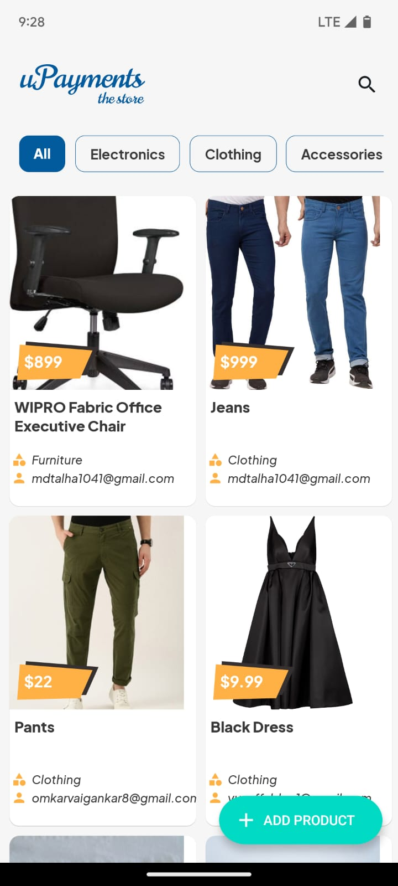
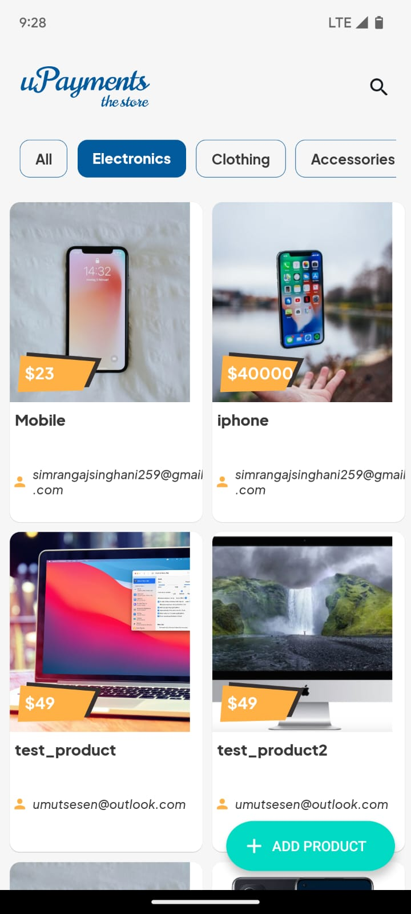
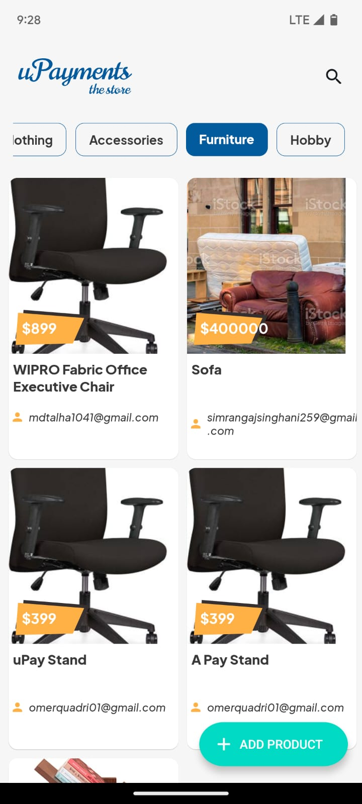
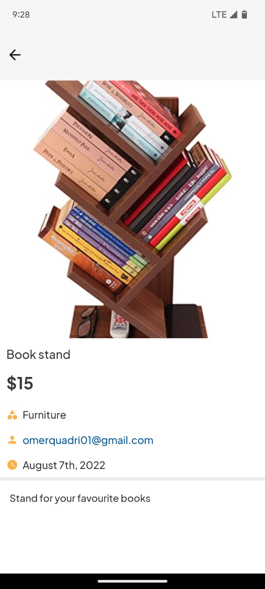
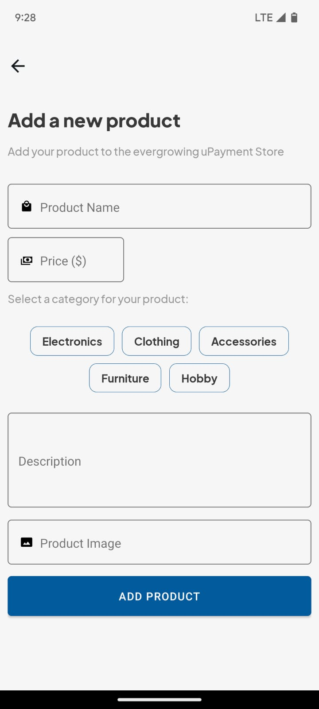
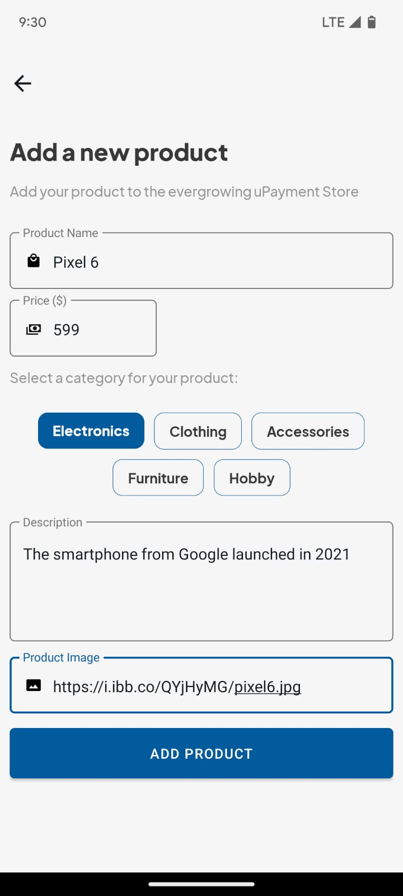
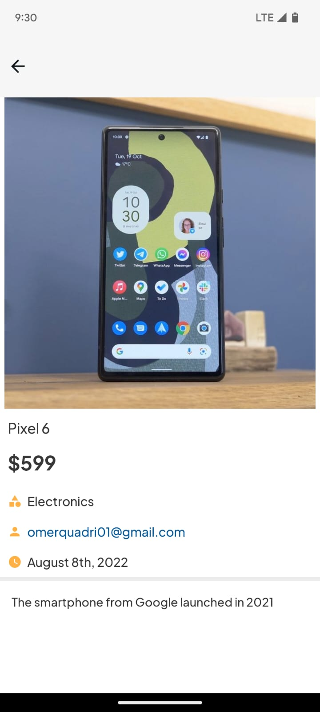
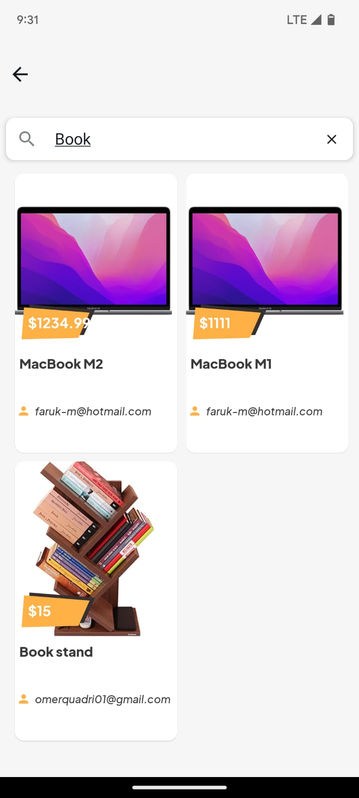

****<!-- App Name -->

<p align="center">
  
</p>

## Preview

You can install an APK for the app using [this link](https://drive.google.com/file/d/1cZdRJDe7QMYW3or-wuSX8ogXyoQvWzCZ/view?usp=sharing)

The video demonstration of the app can be found at [this link](https://drive.google.com/file/d/1cW0iqp89TQg70AYJTuJGsGobRQc6WOa6/view?usp=sharing)

---
## Screenshots
<p align="center">
  
  
  
  
  
  
  
  
</p>

---

## About
uPayStore is a React Native project created to display, search, and view a listing of products fetched from several APIs.
The app is created with React Native version 0.67.4 and utilizes 3rd party libraries like ```react-navigation``` for moving between screens, ```react-native-paper``` for UI components, ```redux``` for State management, ```apisauce``` for API calls etc.

### API endpoints used
- Get Products data

    ```javascript
        https://upayments-studycase-api.herokuapp.com/api/products
    ```

- Get Categories data
    ```javascript
        https://upayments-studycase-api.herokuapp.com/api/categories/
    ```
    
- Post a new Product
    ```javascript
        https://upayments-studycase-api.herokuapp.com/api/products
    ```


### uPay Store has 3 screens:
#### Home screen
  - Displays uPay Store's logo on the left of the header and a search icon on the right which on tapping navigates to the Search screen.
  - Displays a list of all the products on opening the app.
  - Each product is a card that displays:
      - Image of the product
      - Price tag of the product
      - Title of the product
      - Category which the product belongs to
      - Email of the user who posted the product
      - Tapping anywhere on the card  navigates to individual Product Details screen.
  - Pulling down to refresh the Home screen fetches new data (if any) on each refresh.
  - There is an FAB at the bottom right of the screen, tapping on which will navogate the user to a form that lets the user Add a new product.

#### Product Details screen
  - Displays the cover image on top
  - Displays the Title of the product
  - Displays the Price of the product
  - Displays the Category of the post
  - Displys the Email of the user who posted the product
  - Displays the Time when the details of the product were updated in the recent past
  - Displays the Description of the Product

 #### Add Product screen
  - Displays a form to Add a new product
  - Has the following fields:
    - Product name
    - Product Price
    - Selection of Categories available
    - Description of the product
    - URL if the image of the product
  - On successfully filling the form and tapping the "Add Product" button, an API call is made that adds the product to the Database.
  - After adding the Product, the Home screen displays the latest data.
    
#### Search screen
  - Tapping the Search icon on top-right of the header navigates to the Search screen.
  - Displys a Search bar which is focused and ready when the user navigates to the Search screen
  - On typing the search query, a search algorithm runs and finds the products related to the search query
  - The result is displayed as a card with bried details such as:
      - Image of the product
      - Price tag of the product
      - Title of the product
      - Category which the product belongs to
      - Email of the user who posted the product
      - Tapping anywhere on the card  navigates to individual Product Details screen.
 
---
## Notes
- The latest version of React Native (version 0.69.+) was not used for this project because a lot of major 3rd party libraries used in React Native development are still in process of migrating the libraries to the latest version due to React Native's new Architecture introduced recently
- I created the App logo and screenshots using ```Figma```, a design tool for designing and prototyping.
